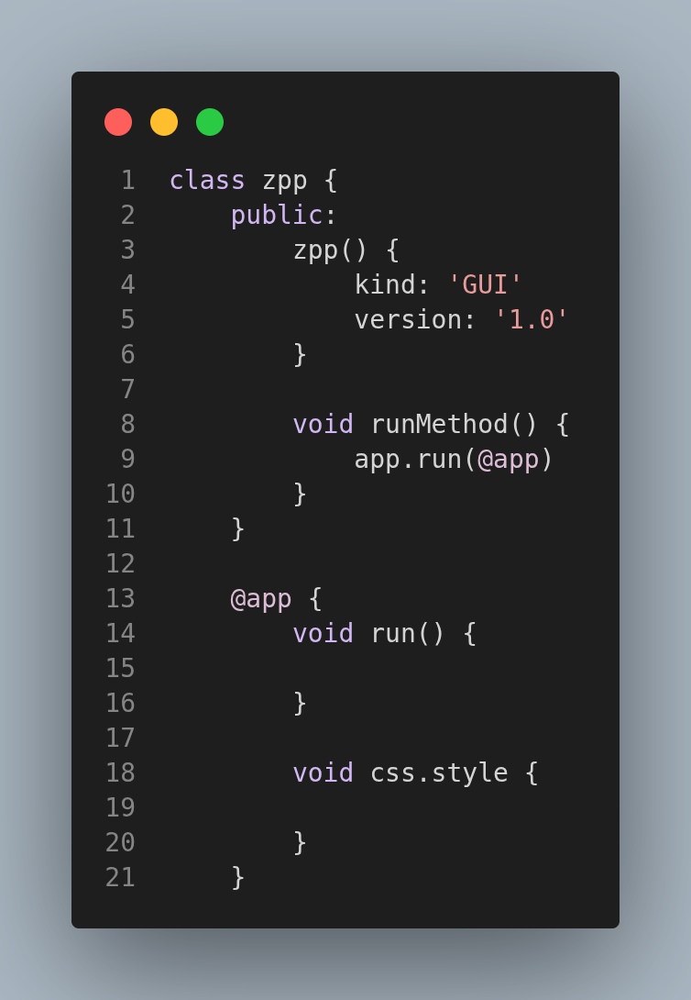
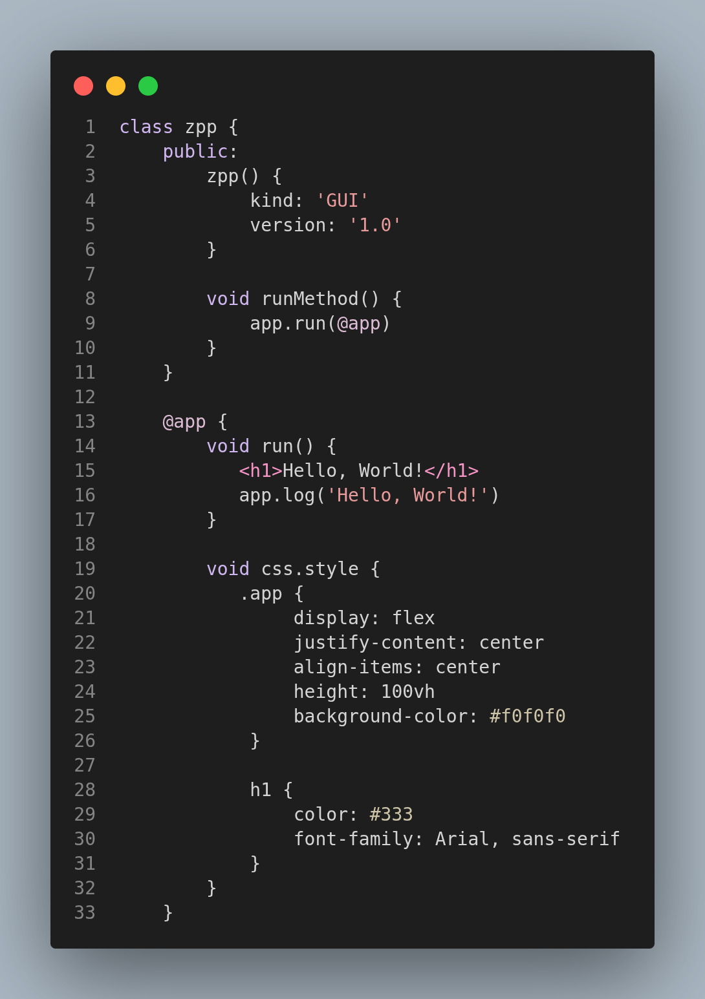
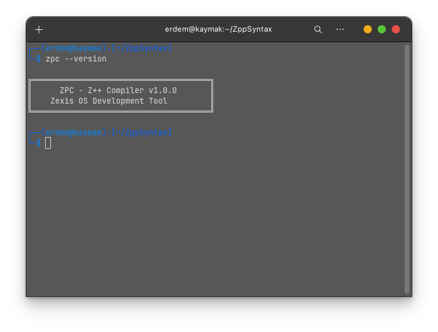

<h1 align="center" style="font-weight: bold;">Z++ Programming Language</h1>

<div align="center">


**A modern programming language for Zexis OS**

[](LICENSE)
[](https://github.com/zexis/zpp/releases)
[](https://www.python.org/)
[](https://www.linux.org/)

[Basic](#basic-code) • [Installation](#installation) • [Quick Start](#quick-start) • [Documentation](#documentation) • [Examples](#examples) • [Contributing](#contributing)

</div>

---

## 📖 About

Z++ is a modern programming language designed specifically for **Zexis OS**. It combines the simplicity of Python with the power of HTML and CSS, allowing developers to create beautiful GUI applications with minimal code.

### Basic Code

```js
class zpp {
    public:
        zpp() {
            kind: 'GUI'
            version: '1.0'
        }

        void runMethod() {
            app.run(@app)
        }
    } 

    @app {
        void run() {
           
        }

        void css.style {
            
        }
    }
```

<div style="display: flex; justify-content: center; gap: 20px; margin: 20px 0;">
  
  
</div>

These codes defines a simple Z++ class with a constructor and a method to run the application. The `@app` block contains methods for running the app and defining CSS styles.

Create properties of your project in `zpp()`. kind shows project type. version shows project version. You can create methods in `@app` block. `run()` method is required to run your app. You can also create a `css.style` method to define your app's styles using CSS syntax.

## Installation

To install Z++, follow these steps:
- Clone the repository:
```bash
https://github.com/YusufErdemK/zpp.git
cd zpp
```
- Install ZPC (Z++ Compiler):
```bash
cd zpc #while in zpp directory
chmod +x install.sh
./install.sh
```
- Verify the installation:
```bash
zpc --version
```


#### Note:
Your terminal directory doesn't need to look like my terminal directory. It is a Zpp VSC project. 

## Quick Start

### Component Meanings
- `class zpp`: Defines a Z++ class named `zpp`.
- `public`: Access modifier indicating that the following members are accessible from outside the class.
- `zpp()`: Constructor method for the `zpp` class, where you can set properties like `kind` and `version`.
- `void runMethod()`: A method that runs the application by calling `app.run(@app)`.
- `@app`: A block that contains methods related to the application, such as `run()` and `css.style()`.
- `void run()`: A method that contains the logic to run the application.
- `void css.style()`: A method where you can define CSS styles for your application.

## How to Compile and Run
To compile and run your Z++ application, use the following commands in your terminal:
```bash
zpc your_app.zpp
```

> This will generate a HTML file named your zpp file name. You can open the generated HTML file in a web browser to see your application in action.

## LICENSE
Z++ is licensed under the <b>GNU General Public License v3.0</b>. See the [LICENSE](LICENSE) file for more details.